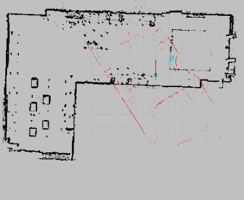

# Map-based Global Localization Using LiDAR and Deep Neural Network

CNN-based global localization project for ROS2 Humble using PyTorch to train model and ONNX Runtime to inference.

[](https://docs.ros.org/en/humble/)
[](https://pytorch.org/)
[](https://onnxruntime.ai/)
[](LICENSE)

## Overview



This project implements a deep learning approach to the **global localization** problem in robotics. Instead of using traditional particle filter methods like AMCL (Adaptive Monte Carlo Localization), we train a convolutional neural network (CNN) to directly regress the robot's pose (x, y, yaw) from a 2D occupancy grid map and a LiDAR scan.

The key idea is to treat localization as an image-to-pose regression problem:
- **Input**: 2-channel image where channel 1 is the occupancy grid map and channel 2 is the current LiDAR scan projected onto the map frame
- **Output**: Robot pose as `[x, y, sin(θ), cos(θ)]`

### Why CNN-based Localization?

- **No initial pose required**: Unlike AMCL, the network can perform global localization from scratch
- **Fast inference**: Single forward pass through the network
- **Robust to symmetries**: CNN learns to disambiguate similar-looking areas
- **End-to-end learning**: No need for manually tuned sensor models

## Prerequisites

- **Ubuntu 22.04** with **ROS2 Humble**
- **Python 3.10+**
- **CUDA-capable GPU** (optional, but recommended)

## Installation
- **Install PyTorch** [PyTorch Installation](https://pytorch.org/get-started/locally/)
- **Install ONNX Runtime** [ONNX Runtime installation](https://onnxruntime.ai/docs/install/)
```bash
# Clone the repository
cd ~/ros2_ws/src
git clone https://github.com/TigerRUS/Map-based-Global-Localization-Using-LiDAR-and-Deep-Neural-Network.git

# Install Python dependencies
pip install onnxruntime onnx numpy matplotlib scikit-learn tqdm
```
