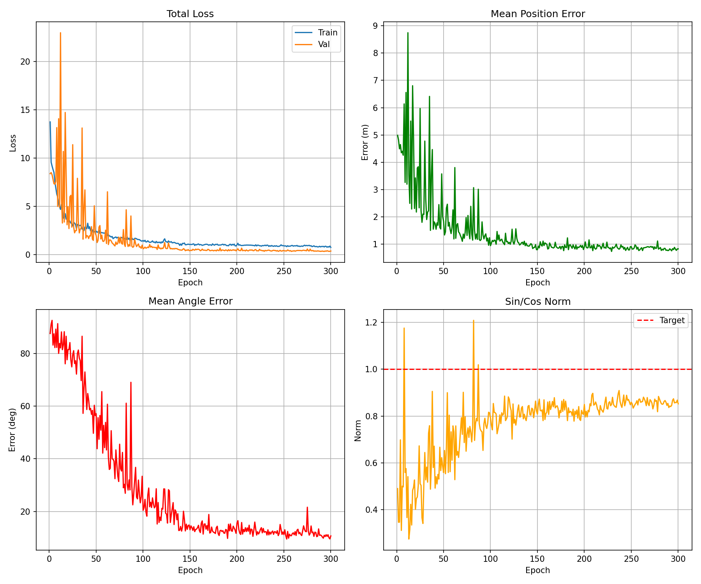

# Deep Neural Network


## Overview

This repository contains training and evaluation scripts for a CNN-based global localization system. The model learns to localize a robot within a known map by comparing the current LiDAR scan with the pre-built map.

### Key Features

- **Dual-input architecture**: Processes map and scan data simultaneously
- **Robust pose estimation**: Outputs position (x, y) and orientation as (sin θ, cos θ)
- **Data augmentation**: 5× dataset expansion through geometric and noise augmentations
- **Combined loss function**: Balances MSE, norm regularization, and angular errors
- **Automatic checkpointing**: Saves best model based on validation loss
- **Training visualization**: Generates plots of training metrics

## Dataset Structure

```
dataset/
├── 0/
│ ├── input/
│ │ ├── map.npz # Occupancy grid map (2D array)
│ │ └── scan.npz # LiDAR scan (2D array)
│ └── output/pose.txt # Ground truth pose [x, y, sinθ, cosθ]
├── 1/
│ ├── input/
│ │ ├── map.npz
│ │ └── scan.npz
│ └── output/pose.txt
└── ...
```

### Data Format Details

- **map.npz**: 2D numpy array (float32), occupancy grid map
- **scan.npz**: 2D numpy array (float32), LiDAR scan data
- **pose.txt**: Text file with 4 float32 values: `x y sin θ cos θ`

## Training Metrics

- **Combined Loss**: Weighted sum of MSE, norm loss, and angular loss
- **Position Error**: Euclidean distance between predicted and true position
- **Angle Error**: Angular difference in degrees (handles circular wrap-around)
- **Sin/Cos Norm**: Regularization constraint (should approach 1.0)

